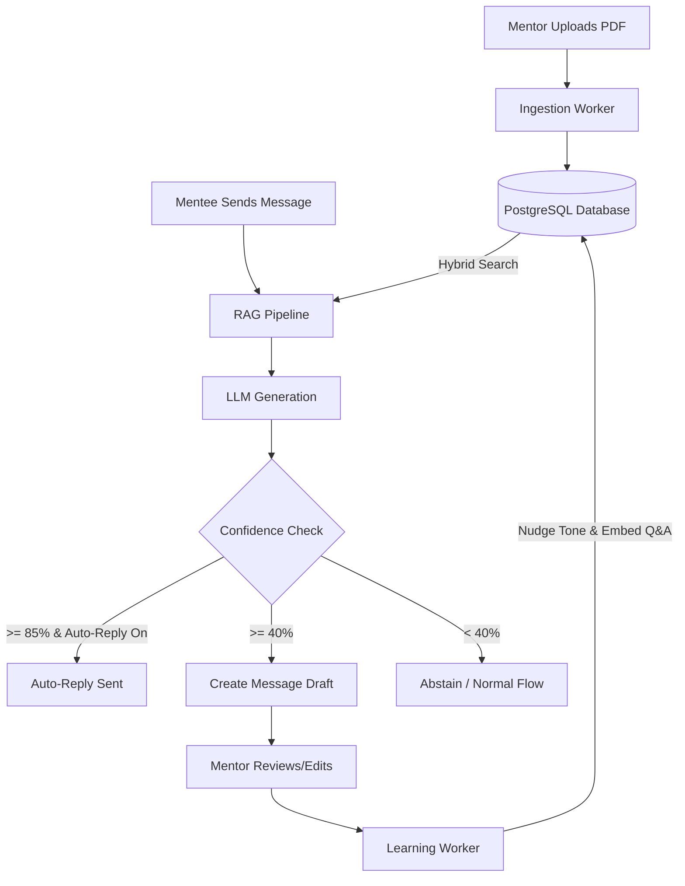
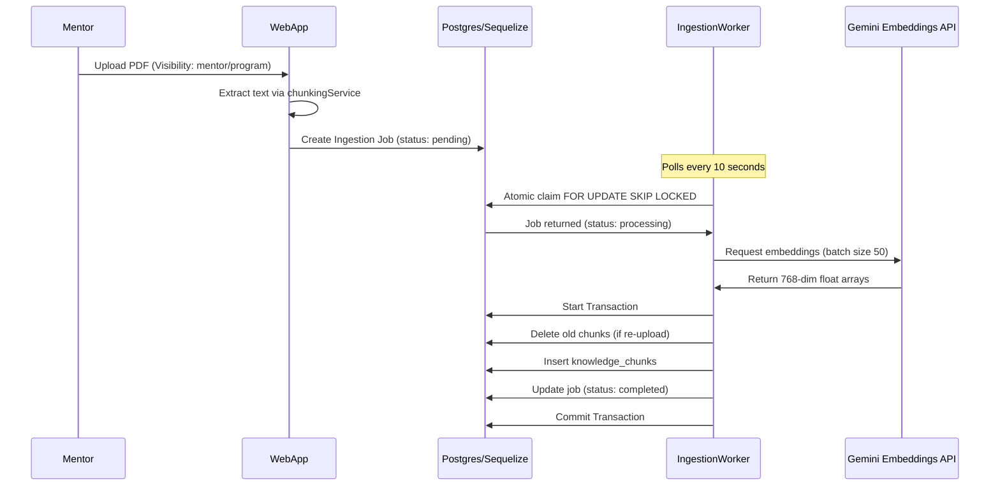
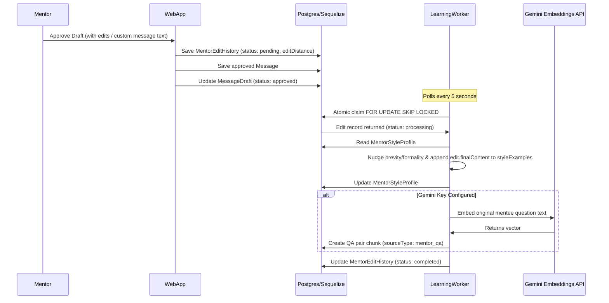

# RAG System — Comprehensive Architecture & Implementation Guide

This document provides a highly detailed, professional, and file-by-file architectural blueprint of the active Retrieval-Augmented Generation (RAG) system implemented in the Pathment platform.

---

## 🏗️ Core System Overview & Architecture

The RAG system enables Mentors to upload knowledge base documents (PDFs) that are chunked, embedded, and stored. When a Mentee sends a message, the system uses a **Hybrid Search** pipeline to retrieve relevant facts, merges them with style guidelines learned from the Mentor's previous edits, builds a prompt, and generates a draft response. The Mentor can then review, edit, and approve the draft, triggering a **feedback loop** that updates the Mentor's style profile and embeds the approved response as a past Q&A example for future reference.



---

## 🗄️ Database Models & Schema

All Sequelize models are consolidated inside [models.js](../server/src/features/rag/models.js) and register against the shared platform database. The underlying database schema is created via the migration file [090_rag_core.js](../server/scripts/migrations/090_rag_core.js).

### 1. `MentorStyleProfile`
Stores the styling metrics, tone controls, auto-reply settings, and few-shot examples representing a Mentor's writing persona.
- `id` (UUID, PK)
- `mentorId` (UUID, unique, FK to `User`)
- `tone` (JSONB): Controls `brevity` (0.0 to 1.0) and `formality` (0.0 to 1.0). Default is `{ brevity: 0.5, formality: 0.5 }`.
- `vocabPrefs` (JSONB): Vocabulary mappings learned from edits.
- `phrasePatterns` (JSONB): Frequently used terms/phrases.
- `styleExamples` (JSONB): Up to 5 of the latest approved final messages.
- `autoReplyEnabled` (BOOLEAN): Auto-send responses when confidence is high.
- `autoReplyLimit` (INTEGER): Maximum auto-replies allowed (default 100).
- `autoReplyCount` (INTEGER): Current month auto-replies sent.

### 2. `KnowledgeChunk`
Stores the embedded context vectors and text segments used for retrieval.
- `id` (UUID, PK)
- `mentorId` (UUID, FK to `User`)
- `menteeId` (UUID, nullable): Ensures per-mentee isolation for context/Q&A. Null for global `mentor_document` chunks.
- `sourceType` (STRING): Type of source - `'mentor_document'`, `'mentor_qa'`, or `'conversation_context'`.
- `sourceId` (UUID): Reference ID of the document, message, or edit history.
- `chunkIndex` (INTEGER): Segment sequence index.
- `contentHash` (CHAR(64)): SHA-256 hash of text for deduplication.
- `content` (TEXT): The actual text segment.
- `embedding` (VECTOR(768)): 768-dimension pgvector embedding generated by Gemini.
- `visibility` (STRING): `'mentor'` or `'program'` visibility scope.

### 3. `RagIngestionJob`
Background worker queue for PDF document parsing, chunking, and embedding.
- `id` (UUID, PK)
- `mentorId` (UUID, FK to `User`)
- `sourceType` (STRING)
- `sourceId` (UUID)
- `text` (TEXT): Extracted raw text.
- `fileName` (STRING, nullable): The uploaded document file name.
- `visibility` (STRING)
- `status` (STRING): `'pending'`, `'processing'`, `'completed'`, or `'failed'`.
- `attempts` (INTEGER): Number of retries attempted.

### 4. `MessageDraft`
AI-generated reply drafts awaiting mentor review.
- `id` (UUID, PK)
- `messageId` (UUID, FK to `Message`)
- `mentorId` (UUID, FK to `User`)
- `menteeId` (UUID, FK to `User`)
- `draftContent` (TEXT): The generated response draft.
- `confidenceScore` (FLOAT): Grounding similarity rating `[0, 1]`.
- `retrievedChunkIds` (JSONB): Chunks utilized to generate this draft.
- `status` (STRING): `'pending'`, `'approved'`, or `'rejected'`.

### 5. `MentorEditHistory`
Records draft-to-final changes to drive the style-learning process.
- `id` (UUID, PK)
- `draftId` (UUID, FK to `MessageDraft`)
- `mentorId` (UUID, FK to `User`)
- `originalContent` (TEXT): The raw AI draft.
- `finalContent` (TEXT): The approved edited response.
- `editDistance` (INTEGER): Levenshtein distance between original and final texts.
- `status` (STRING): `'pending'`, `'processing'`, `'completed'`, or `'failed'`.
- `attempts` (INTEGER): Processing attempts.

---

## 📂 Detailed File-by-File Analysis

The entire backend module lives inside [server/src/features/rag/](../server/src/features/rag/) and adheres to the **Feature-Driven Isolation** design principle.

```
server/src/features/rag/
├── index.js
├── models.js
├── ragConfig.js
├── services/
│   ├── chunkingService.js
│   ├── contextService.js
│   ├── embeddingService.js
│   ├── generationService.js
│   ├── groundingService.js
│   ├── ingestionService.js
│   ├── learningService.js
│   ├── promptBuilder.js
│   ├── ragOrchestrator.js
│   ├── ragService.js
│   └── retrievalService.js
└── workers/
    ├── ingestionWorker.js
    └── learningWorker.js
```

### 1. Module Facade: [index.js](../server/src/features/rag/index.js)
This file represents the single public interface for the RAG system. The rest of the codebase cannot import from sub-folders or direct services; it must interact through this facade.
- **`initializeRag()`**: Instantiates and boots up background queue processors (`ingestionWorker`, `learningWorker`).
- **`RagFacade`**: Exposes functions for processing new incoming messages, retrieving ingested documents, performing document ingestion, approving/rejecting drafts, and deletion.

### 2. Unified Configurations: [ragConfig.js](../server/src/features/rag/ragConfig.js)
The single source of truth for tuning knobs, model types, dimensions, and confidence thresholds:
- **`embedding`**: Maps to Gemini (`gemini-embedding-001`), forcing a dimension length of `768` (via Matryoshka Representation Learning) and default batches of `50`.
- **`chunking`**: Standard windowing bounds: `chunkSize: 250` chars and `overlap: 50` chars.
- **`retrieval`**: Top-K settings (`topK: 10`, `rrfK: 60`), limits, and minimum vector similarity threshold (`0.70`).
- **`thresholds`**: Action cutoffs (`autoReply: 0.85`, `draftReview: 0.40`).
- **`generation`**: Default model temperature set to `0.7`.

### 3. Segmentation: [services/chunkingService.js](../server/src/features/rag/services/chunkingService.js)
- **`extractTextFromBuffer(buffer)`**: Uses `pdf-parse` to convert uploaded raw PDF buffers into raw text strings.
- **`chunkText(text)`**: Uses a sliding window algorithm to divide text into segments. Discards segment remnants under 10 characters.

### 4. Intent Tracking: [services/contextService.js](../server/src/features/rag/services/contextService.js)
- **`saveConversationContext(...)`**: Takes a Mentee's question, embeds it, and stores it in the `knowledge_chunks` table as `conversation_context`.
- *Architecture Design*: Only the **question** is saved, not the answer. This tracks user-intent context without polluting search with static facts that could cause hallucinations or factual leakage later on.
- *Isolation*: It records the `menteeId` directly on the chunk row to isolate retrieval strictly to that Mentee.

### 5. Vector Core: [services/embeddingService.js](../server/src/features/rag/services/embeddingService.js)
- **`embedTexts(texts, apiKey)`**: Coordinates batch embedding using Google's Gemini Batch Embeddings API. Employs a retry delay buffer to manage free-tier rate limits.
- **`embedText(text, apiKey)`**: Helper method for embedding single queries.
- *Core Decision*: Embedding dimensions are strictly hardcoded to `768` using `gemini-embedding-001`'s output dimensionality option to match the database column.

### 6. Multi-LLM Client: [services/generationService.js](../server/src/features/rag/services/generationService.js)
A flexible generation layer that routes LLM text generation depending on the active provider.
- Supported providers: OpenAI (`openai`), Groq (`groq`), OpenRouter (`openrouter`), Anthropic (`anthropic`), Gemini (`gemini`), or custom OpenAPI-compliant endpoints.
- Features **strict URL matching** (`SAFE_BASE_URLS`) to prevent SSRF vulnerability exploits through custom routes.

### 7. Evaluation: [services/groundingService.js](../server/src/features/rag/services/groundingService.js)
- **`scoreGrounding({ draftText, chunks, geminiApiKey })`**: Scores facts against source documents.
- *Fact isolation*: Chunks with `sourceType` values of `mentor_qa` (style reference examples) or `conversation_context` are excluded from grounding verification. Only `mentor_document` chunks are evaluated.
- *Strict strategy*: Returns the maximum similarity score (`Math.max`) across all source documents to ensure the draft matches at least one verified source fact.

### 8. Queue Processing: [services/ingestionService.js](../server/src/features/rag/services/ingestionService.js)
- **`enqueueDocument(...)`**: Writes document metadata to `rag_ingestion_jobs` queue.
- **`processJob(...)`**: Fetches the job, splits the text, generates vector embeddings, deletes any stale document versions, and inserts chunks in a single atomic transaction.

### 9. Feedback Engine: [services/learningService.js](../server/src/features/rag/services/learningService.js)
- **`levenshtein(a, b)`**: Standard character-level edit distance tracker.
- **`processEdit(editId, geminiApiKey)`**: Updates the Mentor's style preferences based on edits.
  - Formality shifts down if emoji count is higher in final response; Brevity shifts up if final output is shorter than the draft.
  - Appends the approved draft to `styleExamples` as a few-shot sample.
  - Saves the final (Question + Answer) as a `mentor_qa` chunk. The question text is embedded so future semantic matches pull this format, but the chunk text contains both elements clearly labeled as an example.

### 10. Assembly: [services/promptBuilder.js](../server/src/features/rag/services/promptBuilder.js)
Separates prompt construction into clear context blocks:
1. **KNOWLEDGE BASE**: Facts from mentor documents (ground truth).
2. **HOW I HAVE REPLIED BEFORE**: Style/tone reference cases (`mentor_qa` chunks).
3. **TOPICS THIS MENTEE HAS COMPLETED**: Awareness of historical contexts.
- Restricts LLM responses using system rules: If no info exists in the Knowledge Base, it outputs `[ABSTAIN_NO_CONTEXT]`.

### 11. Pipeline Coordination: [services/ragOrchestrator.js](../server/src/features/rag/services/ragOrchestrator.js)
Coordinates the runtime flow:
1. Fetches mentor style profile.
2. Resolves Gemini and Groq API keys via BYOK router.
3. Saves incoming question context asynchronously.
4. Performs Hybrid Retrieval.
5. Loads latest thread messages for conversation memory context.
6. Builds prompt and calls generator.
7. Computes grounding score.
8. Triggers `auto-reply`, creates review `MessageDraft`, or `abstains`.

### 12. CRUD Actions: [services/ragService.js](../server/src/features/rag/services/ragService.js)
Supports API operations: listing drafts, queuing edits (`approveDraft`), status changes (`markDraftApproved`, `rejectDraft`), uploading documents, and cleaning up vector rows.

### 13. Workers: [workers/ingestionWorker.js](../server/src/features/rag/workers/ingestionWorker.js) & [workers/learningWorker.js](../server/src/features/rag/workers/learningWorker.js)
- Polling engines running every 10s (ingestion) and 5s (learning).
- Employs atomic claiming (`FOR UPDATE SKIP LOCKED` raw updates) to safely scale across multiple concurrent server nodes.
- Reclaims jobs stuck in `'processing'` status after 10 minutes.

---

## 🔄 Core Pipeline Data Flows

### Ingestion Flow


### Retrieval & Generation Flow
```mermaid
sequenceDiagram
    participant Mentee
    participant MessageService
    participant Orchestrator as ragOrchestrator
    participant DB as Postgres/Sequelize
    participant LLM as Generation Service
    participant MentorSocket

    Mentee->>MessageService: Send Message
    MessageService->>Orchestrator: handleNewMessage(message)
    Orchestrator->>DB: Check if Auto-Reply enabled
    Orchestrator->>DB: Resolve decrypted BYOK keys
    alt Keys missing
        Orchestrator-->>MessageService: Skip silently (no crash)
    end
    Orchestrator->>DB: Save query context (conversation_context)
    Orchestrator->>DB: Hybrid Search (Vector + FTS + RRF)
    DB->>Orchestrator: Return top 10 chunks (mixed type)
    alt No factual document chunks retrieved
        Orchestrator-->>MessageService: Abstain early (no facts to ground on)
    end
    Orchestrator->>DB: Fetch last 10 messages (thread context)
    Orchestrator->>Orchestrator: promptBuilder.buildPrompt()
    Orchestrator->>LLM: generate()
    LLM->>Orchestrator: Draft Text / [ABSTAIN_NO_CONTEXT]
    alt Flipped Abstain
        Orchestrator-->>MessageService: Halt
    end
    Orchestrator->>DB: Calculate grounding score (Max sim against docs)
    alt Score >= 85% AND auto-reply enabled
        Orchestrator->>MessageService: Send auto-reply message
    alt Score >= 40%
        Orchestrator->>DB: Create message_drafts (status: pending)
        Orchestrator->>MentorSocket: Emit ai_draft:new
    else Score < 40%
        Orchestrator-->>MessageService: Abstain
    end
```

### Learning Feedback Loop


---

## 🛠️ Integration Points & Verification

### Code Integrations
1. **Server Initialization**: [index.js](../server/src/index.js) calls `initializeRag()` to start the ingestion and learning queue workers.
2. **New Messages Hook**: [messagingService.js](../server/src/services/messagingService.js) invokes `RagFacade.handleNewMessage(message)` asynchronously after saving incoming Mentee messages.
3. **Approval Handlers**: The messaging controller resolves the approved draft by calling `RagFacade.approveDraft(...)`, creates the actual message, and updates statuses via `RagFacade.markDraftApproved(...)`.

### Test Files

The test files reside in the directory [server/tests/rag/](../server/tests/rag/):

1. **E2E Pipeline Verification**: [rag.pipeline.test.js](../server/tests/rag/rag.pipeline.test.js)
   - Verifies the entire mocked ingestion and processing pipelines.
   - Tests hybrid retrieval score ranking (Vector + FTS + RRF).
   - Validates grounding evaluation (`Math.max` behavior).
   - Tests worker claims (`FOR UPDATE SKIP LOCKED`).
   - Ensures correct style updates and QA vector conversions upon edit completions.
   - Confirms silent failure paths when user-routed API keys are absent.

2. **Provider Route Suite**: [generation.test.js](../server/tests/rag/generation.test.js)
   - Validates that OpenAI SDK compatible routes (OpenAI, Groq, OpenRouter) execute correctly.
   - Validates Anthropic & Gemini API payloads via fetch routing.
   - Enforces **SSRF and malicious proxying protection** (safely fallback to defaults if `baseURL` mismatches).
   - Ensures error handling on malformed JSON structures.

### Running Tests
To run the test suites:
```bash
# Verify the entire pipeline
npm run test tests/rag/rag.pipeline.test.js

# Verify generation routing matrix & security checks
npm run test tests/rag/generation.test.js
```

### Running Migrations
The database schema creation is fully defined in the migration file:
* [090_rag_core.js](../server/scripts/migrations/090_rag_core.js) (registers the `mentor_style_profiles`, `knowledge_chunks` with pgvector/FTS, `rag_ingestion_jobs`, `message_drafts`, and `mentor_edit_histories` tables).

To run the migration:
```bash
node scripts/migrations/090_rag_core.js
```

---

## 🔑 Key Configuration (.env)

Ensure the following variables are defined in your [server/.env](../server/.env) file:

```bash
# ── RAG Tuning ──
RAG_AUTO_REPLY_THRESHOLD=0.85
RAG_DRAFT_THRESHOLD=0.40
RAG_MIN_EDIT_DISTANCE=5
RAG_CHUNK_SIZE=250
RAG_CHUNK_OVERLAP=50
RAG_EMBEDDING_MODEL=gemini-embedding-001
RAG_EMBEDDING_DIMENSIONS=768
RAG_MIN_SIMILARITY=0.70
```
